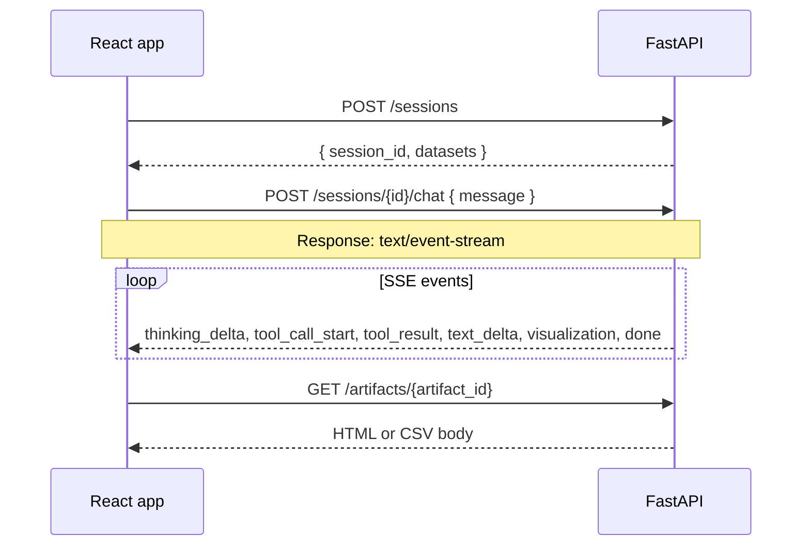

# Data Analysis Agent API — Frontend integration guide

This document describes the HTTP API used by the web client. The backend streams agent activity with **Server-Sent Events (SSE)** on the chat endpoint.

**Default base URL (local):** `http://localhost:8000`

**OpenAPI (interactive):** `http://localhost:8000/docs` (Swagger UI, when the server is running)

---

## Overview



1. Create a **session** once (or per “conversation”).
2. Send each user message to **chat** and read the **SSE stream** until `done`.
3. When a `visualization` event arrives, load the chart or table via **GET /artifacts/{id}**.

---

## Conventions

| Item            | Value                                  |
| --------------- | -------------------------------------- |
| JSON requests   | `Content-Type: application/json`       |
| Chat stream     | `Content-Type: text/event-stream`      |
| CORS (dev)      | `Access-Control-Allow-Origin: *`       |
| Session storage | Server-side; client keeps `session_id` |

---

## Endpoints

### Health check

```http
GET /health
```

**Response 200**

```json
{ "status": "ok" }
```

---

### Create session

Loads CSV datasets from the server `data/` folder and returns a new session id.

```http
POST /sessions
```

**Response 200**

```json
{
  "session_id": "550e8400-e29b-41d4-a716-446655440000",
  "datasets": [
    {
      "name": "carpriceprediction",
      "rows": 205,
      "columns": ["car_ID", "price", "symboling", "..."]
    }
  ]
}
```

**Frontend use:** Call when the app starts (or when the user opens “New conversation”). Store `session_id` in memory or app state.

---

### Get session (optional)

```http
GET /sessions/{session_id}
```

**Response 200**

```json
{
  "session_id": "550e8400-e29b-41d4-a716-446655440000",
  "datasets": [
    {
      "name": "carpriceprediction",
      "rows": 205,
      "columns": ["car_ID", "price"]
    }
  ],
  "message_count": 4,
  "is_streaming": false
}
```

**Response 404** — unknown `session_id`.

Useful for debug UI or disabling send while `is_streaming === true`.

---

### Delete session

```http
DELETE /sessions/{session_id}
```

**Response 204** — no body.

**Response 404** — session not found.

---

### Chat (SSE stream)

```http
POST /sessions/{session_id}/chat
Content-Type: application/json
```

**Request body**

```json
{
  "message": "Show me the price distribution as a histogram"
}
```

| Field     | Type   | Rules                  |
| --------- | ------ | ---------------------- |
| `message` | string | Required, min length 1 |

**Response:** `200` with `Content-Type: text/event-stream` (not JSON).

**Errors before the stream starts** (JSON body, typical FastAPI shape):

| Status | When                                                   |
| ------ | ------------------------------------------------------ |
| 404    | Unknown session                                        |
| 409    | Another chat stream is already running on this session |
| 422    | Empty or invalid `message`                             |

Only **one active chat stream per session** at a time. If you get 409, wait for the current stream to finish or show “Agent busy” and block send.

---

### Get artifact

Plotly HTML figures and CSV tables generated by the agent.

```http
GET /artifacts/{artifact_id}
```

**Response 200**

| `type` (from SSE `visualization` event) | `Content-Type` |
| --------------------------------------- | -------------- |
| `figure`                                | `text/html`    |
| `table`                                 | `text/csv`     |

**Response 404** — unknown artifact id.

**Response 410** — metadata exists but file was removed from disk.

**Frontend use:** After `event: visualization`, fetch `url` from the event (e.g. `/artifacts/{artifact_id}`) and render HTML in an iframe or sandbox, or parse/display CSV.

---

## SSE wire format

Each event is a block:

```
event: <event_type>
data: <json>

```

Blank line between events. Parse line by line: `event:` sets the type, `data:` is JSON for that event.

### Example (abbreviated)

```
event: run_start
data: {"run_id": "abc-123"}

event: thinking_start
data: {}

event: thinking_delta
data: {"delta": "I need to query price data"}

event: thinking_end
data: {}

event: tool_call_start
data: {"tool_call_id": "tc1", "tool_name": "query_data", "args": {"sql": "SELECT ...", "description": "..."}}

event: tool_result
data: {"tool_call_id": "tc1", "tool_name": "query_data", "content": "Query executed successfully..."}

event: text_delta
data: {"delta": "The distribution "}

event: visualization
data: {"artifact_id": "art-456", "title": "Price Distribution", "type": "figure", "url": "/artifacts/art-456"}

event: done
data: {"session_id": "550e8400-e29b-41d4-a716-446655440000"}

```

---

## SSE event reference

| `event`           | When                                 | `data` payload                                                 |
| ----------------- | ------------------------------------ | -------------------------------------------------------------- |
| `run_start`       | Agent run started                    | `{ "run_id": string }`                                         |
| `thinking_start`  | Start of `<thinking>` block          | `{}`                                                           |
| `thinking_delta`  | Token inside thinking                | `{ "delta": string }`                                          |
| `thinking_end`    | End of thinking block                | `{}`                                                           |
| `tool_call_start` | LLM invokes a tool                   | `{ "tool_call_id", "tool_name", "args" }`                      |
| `tool_call_delta` | Tool args streamed incrementally     | `{ "tool_call_id", "args_delta" }`                             |
| `tool_result`     | Tool finished                        | `{ "tool_call_id", "tool_name", "content" }`                   |
| `visualization`   | Chart or table created               | `{ "artifact_id", "title", "type": "figure"\|"table", "url" }` |
| `text_delta`      | Final answer text (outside thinking) | `{ "delta": string }`                                          |
| `error`           | Error during run                     | `{ "message": string }`                                        |
| `done`            | Run finished, history saved          | `{ "session_id": string }`                                     |

### Suggested UI mapping

| SSE event                         | UI area                                         |
| --------------------------------- | ----------------------------------------------- |
| `thinking_*`                      | Collapsible “Thinking” panel, append `delta`    |
| `tool_call_start` / `tool_result` | Tool call card (name, args, result)             |
| `text_delta`                      | Assistant message bubble, append text           |
| `visualization`                   | Chart/table block + link or embed via `GET url` |
| `done`                            | Re-enable input, clear “streaming” indicator    |
| `error`                           | Error toast or inline message                   |

---

## Reading SSE from the browser (POST chat)

`EventSource` only supports **GET**, so chat must use **`fetch` + `ReadableStream`**, not `new EventSource(...)`.

```typescript
async function streamChat(
  sessionId: string,
  message: string,
  onEvent: (type: string, data: Record<string, unknown>) => void,
): Promise<void> {
  const res = await fetch(`${API_BASE}/sessions/${sessionId}/chat`, {
    method: "POST",
    headers: { "Content-Type": "application/json" },
    body: JSON.stringify({ message }),
  });

  if (!res.ok) {
    const err = await res.json().catch(() => ({}));
    throw new Error(err.detail ?? res.statusText);
  }

  const reader = res.body!.getReader();
  const decoder = new TextDecoder();
  let buffer = "";

  while (true) {
    const { done, value } = await reader.read();
    if (done) break;
    buffer += decoder.decode(value, { stream: true });

    const blocks = buffer.split("\n\n");
    buffer = blocks.pop() ?? "";

    for (const block of blocks) {
      let eventType = "";
      let dataLine = "";
      for (const line of block.split("\n")) {
        if (line.startsWith("event: ")) eventType = line.slice(7).trim();
        if (line.startsWith("data: ")) dataLine = line.slice(6);
      }
      if (eventType && dataLine) {
        onEvent(eventType, JSON.parse(dataLine));
      }
    }
  }
}
```

---

## TypeScript types (optional)

```typescript
type DatasetInfo = {
  name: string;
  rows: number;
  columns: string[];
};

type CreateSessionResponse = {
  session_id: string;
  datasets: DatasetInfo[];
};

type ChatRequest = {
  message: string;
};

type VisualizationPayload = {
  artifact_id: string;
  title: string;
  type: "figure" | "table";
  url: string;
};

type SSEHandlers = {
  onRunStart?: (data: { run_id: string }) => void;
  onThinkingDelta?: (data: { delta: string }) => void;
  onToolCallStart?: (data: {
    tool_call_id: string;
    tool_name: string;
    args: Record<string, unknown>;
  }) => void;
  onToolResult?: (data: {
    tool_call_id: string;
    tool_name: string;
    content: string;
  }) => void;
  onVisualization?: (data: VisualizationPayload) => void;
  onTextDelta?: (data: { delta: string }) => void;
  onError?: (data: { message: string }) => void;
  onDone?: (data: { session_id: string }) => void;
};
```

---

## Minimal integration checklist

- [ ] `POST /sessions` on app load → store `session_id`
- [ ] `POST /sessions/{id}/chat` with `fetch` stream parser
- [ ] State: messages, thinking blocks, tool calls, artifacts per run
- [ ] On `visualization`, `GET /artifacts/{artifact_id}` for HTML/CSV
- [ ] Disable send while streaming; handle 409
- [ ] Append `thinking_delta` and `text_delta` incrementally

---

## curl examples

```bash
BASE=http://localhost:8000

# Session
curl -s -X POST "$BASE/sessions" | jq

SESSION_ID="<paste session_id>"

# Chat stream
curl -N -X POST "$BASE/sessions/$SESSION_ID/chat" \
  -H "Content-Type: application/json" \
  -d '{"message": "How many rows in carpriceprediction?"}'

# Artifact (after visualization event)
curl -s "$BASE/artifacts/<artifact_id>" -o chart.html
```

---

## Related docs

- Design spec: `docs/superpowers/specs/2026-06-14-fastapi-sse-api-design.md`
- Interactive API: `http://localhost:8000/docs`
