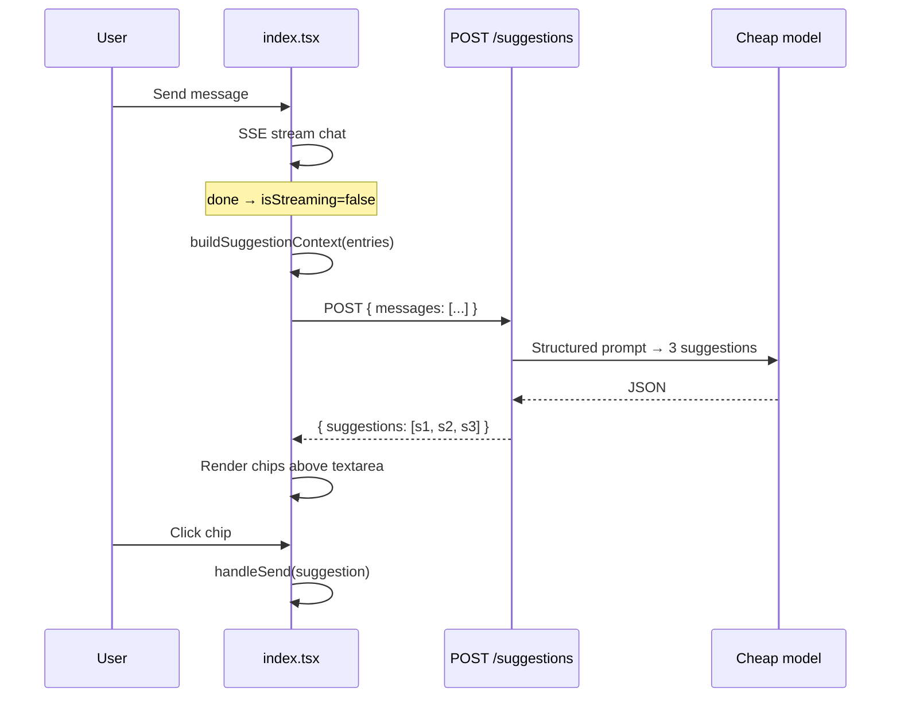

# Chat Follow-up Suggestions — Design Spec

**Date:** 2026-06-14  
**Status:** Approved (pending final spec review)  
**Scope:** Post-stream follow-up suggestions — minimal backend endpoint + cheap frontend chips

## Goal

After each successful chat SSE stream completes, show **3 clickable suggestion chips** above the input. Clicking a chip **immediately sends** that text as the next user message.

Suggestions are generated by a **cheap LLM** using a **windowed conversation context** (~4000 characters), including user messages, assistant text, and **tool call results** (so errors are visible to the suggestion model).

This is a pragmatic hack: small backend addition, most logic on the frontend, silent failure on errors.

## Context

- **Existing chat flow:** `web/src/routes/index.tsx` manages `entries` (transcript), streams via `POST /sessions/{id}/chat`, sets `isStreaming = false` when done.
- **Transcript model:** `web/src/types/transcript.ts` — `chat_request`, `chat_run` with segments (`text`, `thinking`, `tool`, `status`, `visualization`).
- **Backend:** FastAPI with pydantic-ai agent; API keys in `.env`; no suggestions endpoint today.
- **Server history:** `session.message_history` exists but is pydantic-ai internal — not used for this feature.

## Decisions

| Topic | Decision |
|-------|----------|
| LLM call location | New backend endpoint `POST /sessions/{id}/suggestions` |
| Context source | Built on frontend from local `entries` |
| Context window | ~4000 characters, most recent messages first |
| Context contents | User messages, assistant `text` segments, tool calls (args + result) |
| Context exclusions | Thinking, status, visualizations, transcript errors |
| Tool result truncation | Max 500 characters per tool result before counting toward window |
| Click behavior | Immediate send (same as pressing Enter) |
| Failure handling | Silent in UI; `console.warn` in devtools only |
| Loading UX | No spinner — chips appear when ready or not at all |
| SSE changes | None — suggestions are a separate HTTP call after stream ends |

## Architecture



### Approach chosen

**Dedicated endpoint + frontend-built context** (over server-side `message_history` or SSE-embedded suggestions):

- Minimal backend (~40 lines)
- Frontend controls exactly what the suggestion model sees
- No changes to chat streaming pipeline

## Frontend

### `buildSuggestionContext(entries, maxChars = 4000)`

Walk `entries` chronologically and produce `{ role, content }[]`:

| Transcript source | Role | Content |
|-------------------|------|---------|
| `chat_request.message` | `user` | Message as-is |
| `chat_run` segments `kind: "text"` | `assistant` | Concatenate consecutive text segments within each run |
| `chat_run` segments `kind: "tool"` | `tool` | `[{name}] args: {json}\nresult: {text}` |

**Tool rules:**

- Include `args` (JSON, compact)
- Include `result` when present (errors appear here)
- Skip tools with `result === undefined` (incomplete run)
- Truncate each tool `result` to 500 characters before window accounting

**Window rules:**

- Count characters across user + assistant + tool messages
- Start from most recent messages, walk backward until ~4000 chars
- Return array in chronological order

**Excluded:** `thinking`, `status`, `visualization`, `error` entries, session bootstrap entries.

### Post-stream fetch lifecycle

Trigger when `isStreaming` transitions `true → false` **and** the last `chat_run` has `status: "done"`.

Do **not** fetch when:

- Last run ended in `error`
- No assistant response exists yet
- Context array is empty after filtering

Clear suggestions when:

- User sends a new message (including via chip click)
- A new stream starts

Use `AbortController` (or equivalent) to ignore stale responses from React Strict Mode double effects.

### UI — `SuggestionChips`

Location: inside the fixed `chat-input-block`, **above** the textarea.

Style: cheap pills — `text-xs`, slate border, white background, hover slate-50. Truncate display at ~80 characters; full text in `title` attribute.

Props: `suggestions: string[]`, `onSelect: (text: string) => void`, hidden when empty or streaming.

### `index.tsx` integration

- State: `suggestions: string[]`
- Effect: post-stream fetch via new `fetchSuggestions(sessionId, messages)` in `api.ts`
- Pass suggestions + handler to `ChatInput`
- Chip click → call existing `handleSend` with suggestion text (bypasses textarea)

### `api.ts` addition

```typescript
export type SuggestionMessage = {
  role: "user" | "assistant" | "tool";
  content: string;
};

export async function fetchSuggestions(
  sessionId: string,
  messages: SuggestionMessage[],
): Promise<string[]>
```

POST to `/sessions/{sessionId}/suggestions`, return `suggestions` array from JSON.

## Backend

### Endpoint

`POST /sessions/{session_id}/suggestions`

**Request body:**

```json
{
  "messages": [
    { "role": "user", "content": "..." },
    { "role": "assistant", "content": "..." },
    { "role": "tool", "content": "[query_data] args: {...}\nresult: Error: ..." }
  ]
}
```

**Response:**

```json
{
  "suggestions": ["...", "...", "..."]
}
```

**Errors:**

- `404` — session not found
- `422` — invalid body
- `500` — LLM failure (frontend treats as silent failure)

No stream lock — independent of active chat streaming.

### Schemas (`api/schemas.py`)

- `SuggestionMessage`: `role: Literal["user", "assistant", "tool"]`, `content: str`
- `SuggestionRequest`: `messages: list[SuggestionMessage]` (min 1)
- `SuggestionResponse`: `suggestions: list[str]` (exactly 3)

### Service

New function (e.g. `api/services/suggestion_service.py` or inline in route):

- Minimal pydantic-ai `Agent` with **no tools**
- Model from `SUGGESTIONS_MODEL` env var; fallback to `gpt-5-nano-2025-08-07`
- Structured output: `{ suggestions: list[str] }` with exactly 3 items
- System prompt (French):

> Tu proposes 3 questions de suivi courtes et actionnables que l'utilisateur pourrait poser à un assistant d'analyse de données. Les messages `tool` sont des appels d'outils exécutés par l'assistant — si un result contient une erreur, propose des suggestions qui aident à corriger ou contourner le problème. Réponds en français. Chaque suggestion doit tenir en une phrase courte.

Pass conversation as user message (formatted transcript) or as message list per pydantic-ai API.

### Route registration

Add to `api/routes/chat.py` or new `api/routes/suggestions.py`, registered in `api/main.py`.

### Environment

Add to `.env.example`:

```
# Cheap model for follow-up suggestions (PydanticAI format)
#SUGGESTIONS_MODEL=gpt-5-nano-2025-08-07
```

## Error handling

| Case | Behavior |
|------|----------|
| Suggestions API fails | `console.warn`, no UI change |
| Response has ≠ 3 items | Use first 3 if ≥ 1; ignore if empty |
| Stream ended in `error` | No fetch |
| Click during stream | Impossible — chips hidden while streaming |
| Stale fetch response | Aborted / ignored via AbortController |

## Testing

| Layer | Test |
|-------|------|
| Frontend | Manual smoke test in v1; `buildSuggestionContext` is a pure function (easy to unit-test later if vitest is added) |
| Backend | Unit test route/service with mocked agent returning 3 structured strings |
| E2E | Manual smoke test only |

## Out of scope

- Suggestions embedded in SSE stream
- Reading `session.message_history` server-side
- Spinner / loading skeleton for suggestions
- User-visible error messages for suggestion failures
- Persisting suggestion history
- i18n beyond French suggestions

## Files (expected)

| File | Change |
|------|--------|
| `web/src/lib/buildSuggestionContext.ts` | **Create** — context builder |
| `web/src/lib/api.ts` | Add `fetchSuggestions` |
| `web/src/components/SuggestionChips.tsx` | **Create** — chip UI |
| `web/src/components/ChatInput.tsx` | Accept and render suggestions |
| `web/src/routes/index.tsx` | Post-stream fetch + state |
| `api/schemas.py` | Request/response models |
| `api/routes/chat.py` or `suggestions.py` | New endpoint |
| `api/services/suggestion_service.py` | **Create** — LLM call |
| `.env.example` | Document `SUGGESTIONS_MODEL` |
| `tests/unit/test_suggestion_service.py` | **Create** |
