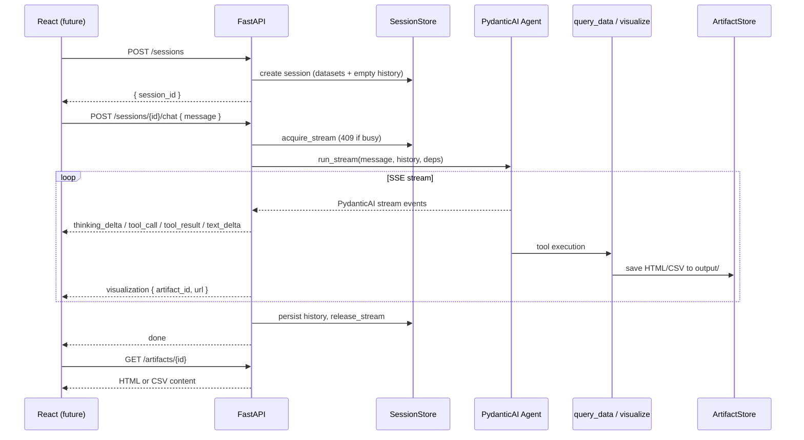

# FastAPI SSE API — Design Spec

**Date:** 2026-06-14  
**Status:** Approved (pending final spec review)  
**Scope:** Backend API only — no frontend

## Goal

Transform the existing CLI data-analysis agent into a FastAPI backend that streams agent activity to a future React client via Server-Sent Events (SSE). The code must be readable, well-documented, modular, and tested with TDD.

## Context

The agent (PydanticAI) can:
- Execute SQL queries via DuckDB (`query_data`)
- Create Plotly visualizations or CSV tables (`visualize`)
- Emit reasoning inside `<thinking>` tags in text parts

Outputs are written to `output/` as HTML (figures) or CSV (tables).

## Decisions

| Topic | Decision |
|-------|----------|
| Session model | Server-side sessions with UUID, in-memory store |
| Concurrent streams | One active stream per session; return `409` if busy |
| Artifact delivery | Hybrid: SSE metadata + `GET /artifacts/{id}` |
| SSE format | Custom typed events (not Vercel AI SDK) |
| Thinking extraction | Parse `<thinking>` tags from text deltas |
| Session storage | In-memory dict (case study; note Redis swap point in comments) |
| Architecture | Layered modules: routes / services / streaming |
| Testing | TDD, unit → integration, agent mocked in CI |
| Code style | Docstrings, explicit types, comments on *why* not *what* |

## Architecture



### Components

| Component | Responsibility |
|-----------|----------------|
| `SessionStore` | In-memory dict: `session_id → Session` |
| `ChatService` | Runs `agent.run_stream()`, feeds events to translator, updates session |
| `StreamTranslator` | Maps PydanticAI events → custom SSE event types |
| `ThinkingParser` | Stateful parser on text deltas: `<thinking>` → `thinking_delta`, rest → `text_delta` |
| `ArtifactStore` | Registers files from `visualize` tool; serves via `GET /artifacts/{id}` |

## API Endpoints

| Method | Path | Description |
|--------|------|-------------|
| `POST` | `/sessions` | Create session, load datasets from `data/`, return `{ session_id, datasets }` |
| `GET` | `/sessions/{session_id}` | Session info (datasets, message count, `is_streaming`) |
| `DELETE` | `/sessions/{session_id}` | Delete session and free memory |
| `POST` | `/sessions/{session_id}/chat` | Send message, returns SSE stream |
| `GET` | `/artifacts/{artifact_id}` | Fetch HTML or CSV artifact |
| `GET` | `/health` | Health check |

### POST /sessions — Response

```json
{
  "session_id": "uuid-v4",
  "datasets": [
    { "name": "carpriceprediction", "rows": 205, "columns": ["car_ID", "price"] }
  ]
}
```

### POST /sessions/{session_id}/chat — Request

```json
{ "message": "Show me the price distribution" }
```

Response: `Content-Type: text/event-stream`

Synchronous errors (before stream starts):
- `404` — unknown session
- `409` — stream already active on this session
- `422` — empty or invalid message

### GET /artifacts/{artifact_id}

- `figure` → `Content-Type: text/html`
- `table` → `Content-Type: text/csv`
- `404` — unknown artifact
- `410 Gone` — artifact file deleted from disk

CORS enabled (`allow_origins=["*"]` in dev) for future React client.

## SSE Event Protocol

Format: `event: <type>\ndata: <json>\n\n`

| Event | When | Payload |
|-------|------|---------|
| `run_start` | Run begins | `{ "run_id": "uuid" }` |
| `thinking_start` | Start of `<thinking>` block | `{}` |
| `thinking_delta` | Token inside `<thinking>` | `{ "delta": "..." }` |
| `thinking_end` | End of `</thinking>` block | `{}` |
| `tool_call_start` | LLM invokes a tool | `{ "tool_call_id", "tool_name", "args" }` |
| `tool_call_delta` | Tool args streamed incrementally | `{ "tool_call_id", "args_delta" }` |
| `tool_result` | Tool completed | `{ "tool_call_id", "tool_name", "content" }` |
| `visualization` | `visualize` produced an artifact | `{ "artifact_id", "title", "type", "url" }` |
| `text_delta` | Final answer text (outside thinking) | `{ "delta": "..." }` |
| `error` | Error during run | `{ "message": "..." }` |
| `done` | Run complete, history persisted | `{ "session_id" }` |

### PydanticAI → SSE Mapping

| PydanticAI Event | SSE Event(s) |
|------------------|--------------|
| `PartStartEvent` (TextPart) | — (parser decides) |
| `PartDeltaEvent` + `TextPartDelta` | `ThinkingParser` → `thinking_delta` or `text_delta` |
| `PartDeltaEvent` + `ToolCallPartDelta` | `tool_call_delta` |
| `FunctionToolCallEvent` | `tool_call_start` |
| `FunctionToolResultEvent` | `tool_result` (+ `visualization` if `visualize`) |
| `FinalResultEvent` | — (marks start of final answer) |
| Stream end | `done` |

## ThinkingParser

Stateful incremental parser receiving raw `TextPartDelta` content:

```
States: OUTSIDE | IN_THINKING | MAYBE_TAG

"<thinking>" detected  → thinking_start, enter IN_THINKING
"</thinking>" detected → thinking_end, enter OUTSIDE
Content in IN_THINKING → thinking_delta
Content in OUTSIDE     → text_delta
```

Handles tags split across deltas (e.g. `"<thi"` then `"nking>"`) via a partial buffer.

## Session Model

```python
@dataclass
class Session:
    id: str
    context: AgentContext          # datasets + current_dataframe
    message_history: list          # pydantic_ai messages
    is_streaming: bool = False
    created_at: datetime
    lock: asyncio.Lock             # protects is_streaming
```

### SessionStore Methods

| Method | Behavior |
|--------|----------|
| `create(datasets, dataset_info) → Session` | New session with loaded datasets |
| `get(session_id) → Session \| None` | Lookup |
| `delete(session_id) → bool` | Remove session |
| `acquire_stream(session_id) → Session` | Set `is_streaming=True`, raise 409 if already active |
| `release_stream(session_id)` | Set `is_streaming=False` (always in `finally`) |

## Artifact Model

```python
@dataclass
class Artifact:
    id: str
    filepath: Path
    title: str
    type: Literal["figure", "table"]
    session_id: str
    created_at: datetime
```

When `visualize` completes, `ChatService` detects the output path from `tool_result` content (`Saved to: output/...`), registers it in `ArtifactStore`, and emits a `visualization` SSE event.

No changes to existing `visualize` tool — interception happens at the streaming layer.

## File Structure

```
case_fullstack/
├── agent/                          # unchanged
├── api/
│   ├── __init__.py
│   ├── main.py                     # FastAPI app, lifespan, CORS, mount routes
│   ├── dependencies.py             # DI: get_session_store(), get_artifact_store()
│   ├── routes/
│   │   ├── __init__.py
│   │   ├── sessions.py             # POST/GET/DELETE /sessions
│   │   ├── chat.py                 # POST /sessions/{id}/chat → SSE
│   │   └── artifacts.py            # GET /artifacts/{id}
│   ├── services/
│   │   ├── __init__.py
│   │   ├── session_store.py        # SessionStore protocol + InMemorySessionStore
│   │   ├── artifact_store.py       # ArtifactStore protocol + InMemoryArtifactStore
│   │   └── chat_service.py         # Orchestration: run_stream → SSE events
│   └── streaming/
│       ├── __init__.py
│       ├── sse.py                  # encode_event(type, data) → SSE string
│       ├── thinking_parser.py      # Stateful <thinking> tag parser
│       └── translator.py           # PydanticAI events → list[SSEEvent]
├── tests/
│   ├── __init__.py
│   ├── conftest.py                 # Fixtures: stores, test client
│   ├── unit/
│   │   ├── test_thinking_parser.py
│   │   ├── test_sse.py
│   │   ├── test_translator.py
│   │   ├── test_session_store.py
│   │   └── test_artifact_store.py
│   └── integration/
│       ├── test_sessions_api.py
│       ├── test_chat_api.py
│       └── test_artifacts_api.py
├── Dockerfile.api
└── docker-compose.yml              # + api service
```

### Code Principles

- Each module = one responsibility, ~50–100 lines max
- Google-style docstrings on every public class/function
- Comments only on *why* (not *what*)
- Explicit types everywhere (`Literal`, `Protocol`, dataclasses)
- No magic strings — constants for SSE event types

## TDD Strategy

Implementation order (test-first, isolated → integrated):

1. `test_thinking_parser.py` — pure function, zero deps
2. `test_sse.py` — pure encoding
3. `test_session_store.py` — in-memory, async
4. `test_artifact_store.py` — in-memory, file I/O
5. `test_translator.py` — mocked PydanticAI events
6. `test_sessions_api.py` — FastAPI TestClient
7. `test_artifacts_api.py` — FastAPI TestClient
8. `test_chat_api.py` — SSE with mocked agent

### Mock Strategy

- Mock `create_agent()` in integration tests to return a fake agent with predefined events
- Verify SSE sequence received by client (httpx + SSE parse)
- No real LLM calls in CI

### Key Test Cases (ThinkingParser)

- Plain text → `text_delta` only
- Full `<thinking>...</thinking>` block → `thinking_start`, `thinking_delta`, `thinking_end`
- Tag split across deltas → correct reassembly
- Text before and after thinking block → separate `text_delta` events

## Error Handling

| Situation | Behavior |
|-----------|----------|
| Unknown session | `404` JSON (before stream) |
| Stream already active | `409` JSON (before stream) |
| LLM error during run | SSE `error` then `done` |
| Tool crash (SQL error) | SSE `tool_result` with error message (agent continues) |
| Client disconnects mid-stream | `release_stream()` in generator `finally` |
| Artifact not found | `404` JSON |
| Artifact file deleted from disk | `410 Gone` |

## Docker & Run

**Dockerfile.api:**
```dockerfile
FROM python:3.12-slim
WORKDIR /app
COPY requirements.txt .
RUN pip install --no-cache-dir -r requirements.txt
COPY . .
CMD ["uvicorn", "api.main:app", "--host", "0.0.0.0", "--port", "8000"]
```

**docker-compose.yml** — add `api` service with ports `8000:8000`, volumes for `data/` and `output/`.

**Local dev:**
```bash
uvicorn api.main:app --reload --port 8000
pytest tests/ -v
```

**New dependencies:** `fastapi`, `uvicorn`, `httpx`, `pytest`, `pytest-asyncio`

## Out of Scope

- Frontend React application
- Persistent session storage (Redis/SQLite)
- Multiple concurrent streams per session
- Authentication / authorization
- Artifact cleanup / TTL

## Future Extensions (noted in code comments)

- Replace in-memory `SessionStore` with Redis
- Cancel-in-flight stream (`cancel_previous: true`)
- Session TTL and background cleanup
- Multiple uvicorn workers with sticky sessions or distributed lock
